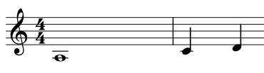

## Post-crusifixion's code

### Introduction

An esoteric programming language inspired by [Piet](https://www.dangermouse.net/esoteric/piet.html) programming language and Spinetta's song [Post-crusifixion](https://www.youtube.com/watch?v=oc23xuIFdoM).

While Piet will program code in an abstract art form, Post-crusifixion aims to do the same but using music, and more specifically taking advantage 
of the [Pentatonic minor scale](https://en.wikipedia.org/wiki/Pentatonic_scale), which should sound pretty well with a blues backtrack ;).

### Language Specification

The language is based on pentatonic minor scales, and should start with the key note and the main octave.
So, let's say that we want to use the A minor pentatonic scale (A-C-D-E-G) we should start with the bassest pitch.

Also it's a stack based programming language, that means it doesn't have variables or registers, it just push and pop from the stack.

As Piet, the notes and octaves are related in the following way:

Notes cycle: 1st pentatonic note (main)-> 2nd pentatonic note-> 3rd pentatonic note-> 4th pentatonic note-> 5th pentatonic note -> 1st pentatonic note again
Octave cycle: Bassest pitch -> Bassest pitch +1 octave -> Bassest pitch +2 octaves -> Bassest pitch

**It's possible to combine octave change plus note change**

### Commands

<table>
<tr>
  <th></th>
  <th colspan="5">Note change</th>
</tr>
<tr>
  <th>Octave change (in cycles)</th>
  <th>No change</th>
  <th>1 step</th>
  <th>2 step</th>
  <th>3 step</th>
  <th>4 step</th>
</tr>
<tr>
  <th>No change</th>
  <td>NOP</td>
  <td>push</td>
  <td>pop</td>
  <td>add</td>
  <td>substract</td>
</tr>
<tr>
  <th>+1 octave</th>
  <td>multiply</td>
  <td>divide</td>
  <td>mod</td>
  <td>not</td>
  <td>greater</td>
</tr>
<tr>
  <th>+2 octave</th>
  <td>duplicate</td>
  <td>in(number)</td>
  <td>in(char)</td>
  <td>out(number)</td>
  <td>out(char)</td>
</tr>
</table>  

#### Command explanation (from Piet)

- push: Pushes the value of the duration of the last note on to the stack. That values of note blocks are not automatically pushed on to the stack - this push operation must be explicitly carried out.
- pop: Pops the top value off the stack and discards it.
- add: Pops the top two values off the stack, adds them, and pushes the result back on the stack.
- subtract: Pops the top two values off the stack, calculates the second top value minus the top value, and pushes the result back on the stack.
multiply: Pops the top two values off the stack, multiplies them, and pushes the result back on the stack.
- divide: Pops the top two values off the stack, calculates the integer division of the second top value by the top value, and pushes the result back on the stack. If a divide by zero occurs, it is handled as an implementation-dependent error, though simply ignoring the command is recommended.
- mod: Pops the top two values off the stack, calculates the second top value modulo the top value, and pushes the result back on the stack. The result has the same sign as the divisor (the top value). If the top value is zero, this is a divide by zero error, which is handled as an implementation-dependent error, though simply ignoring the command is recommended. (See note below.)
- not: Replaces the top value of the stack with 0 if it is non-zero, and 1 if it is zero.
- greater: Pops the top two values off the stack, and pushes 1 on to the stack if the second top value is greater than the top value, and pushes 0 if it is not greater.
- duplicate: Pushes a copy of the top value on the stack on to the stack.
- roll: Pops the top two values off the stack and "rolls" the remaining stack entries to a depth equal to the second value popped, by a number of rolls equal to the first value popped. A single roll to depth n is defined as burying the top value on the stack n deep and bringing all values above it up by 1 place. A negative number of rolls rolls in the opposite direction. A negative depth is an error and the command is ignored. If a roll is greater than an implementation-dependent maximum stack depth, it is handled as an implementation-dependent error, though simply ignoring the command is recommended.
- in: Reads a value from STDIN as either a number or character, depending on the particular incarnation of this command and pushes it on to the stack. If no input is waiting on STDIN, this is an error and the command is ignored. If an integer read does not receive an integer value, this is an error and the command is ignored.
- out: Pops the top value off the stack and prints it to STDOUT as either a number or character, depending on the particular incarnation of this command.

### Note value or duration

The [note value](https://en.wikipedia.org/wiki/Note_value) will be the number to be pushed (contiguous notes will be sumarized and the same with chords) to the stack.

Let's see an quick and easy example:

The following music sheet in A minor pentatonic scale, which is an A with a duration of 4 (whole duration in a 4/4 time signature) followed by a C, which is a +1 in
the note scale will push a 4 into the stack. After that, we have a D which is also a push, but in this case a push 1, because the duration of the C note is 1.

- **Silences:** Are equivalent to white in Piel, so they're free zones which the interpreter passes unhindered.
- **Chords:** Will be summarized to be operated, the root note will have meaning for cycles and the duration of the component notes will be summarized.
- **Out of scale notes:** Will be equivalent to silences (except in chords), so you can change the pitch to your song, jam a little bit and then come back to the roots and code!
- **Ties:**  It can be used and will be considered as independant notes.